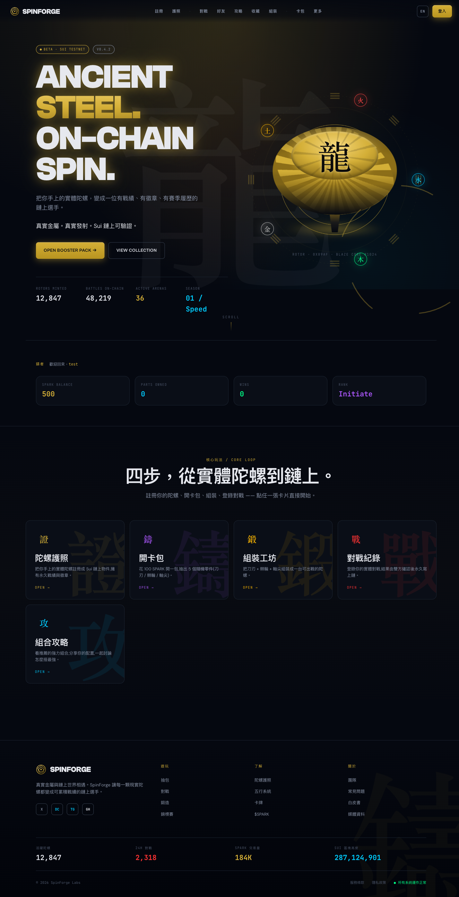
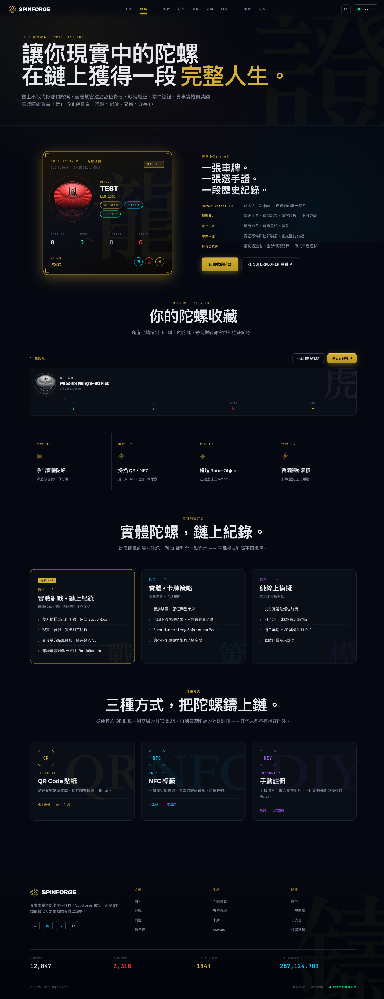

# SpinForge

**Beyblade X-inspired blockchain card game built on Sui Move.**

Every physical spinning top becomes an on-chain athlete with a permanent battle record. Players collect NFT parts (Blade / Ratchet / Bit), assemble them into battle tops, record real-world matches on-chain, and compete in a Wuxing (five-element) economy powered by the **SPARK** token.

No wallet required — players sign in with email or Google. The platform custodies all on-chain assets and relays every Sui transaction through admin signers, while a Postgres ledger attributes ownership to each user (**web2-hybrid** model).

📖 **Full system documentation with screenshots and contract reference: [docs/SYSTEM_OVERVIEW.md](./docs/SYSTEM_OVERVIEW.md)**



## What You Can Do

| Feature | Description |
|---------|-------------|
| **Passport** | Register a physical top as a Sui NFT with lifetime battle history (QR / NFC / manual) |
| **Packs** | Open gacha packs (100 SPARK → 5 random parts, 70/22/7/1 rarity odds via `sui::random`) |
| **Workshop** | Assemble Blade + Ratchet + Bit into a battle-ready Bey |
| **Forge** | Evolve (3 Common → 1 Rare), Fuse (2 Rare → 1 Epic), Retune stats — all burning SPARK |
| **Battle** | Record real matches with dual-player confirmation → immutable on-chain `BattleRecord` + ELO |
| **Tournament** | Bracket competitions with escrowed SPARK prize pools |
| **Market** | P2P trading via Sui Kiosk with capped 2% royalties |
| **Social** | Friends, direct messages, and community combo guides with voting |



## Architecture

```
Player (email/Google sign-in, no wallet)
        │  Better Auth session cookie
        ▼
Next.js 14 (web/) — pages + ~28 API routes
  · Drizzle ORM → Neon Postgres (profiles, ownership, SPARK ledger, battles, social)
  · Transactional outbox for Postgres ↔ Sui consistency
        │  Admin relay signers (minter / recorder / custodian)
        ▼
Sui Testnet — `spinforge` Move package (20 modules, 189 tests)
```

| Layer | Technology |
|-------|-----------|
| **Smart contracts** | Sui Move — 20 modules, 189 unit tests passing |
| **Frontend** | Next.js 14 (App Router), React 18, Tailwind, PixiJS |
| **Auth** | Better Auth (email/password, Google/Apple OAuth, magic link) — session cookies, no wallets |
| **Database** | PostgreSQL (Neon) via Drizzle ORM, Upstash Redis |
| **Real-time (phase 2)** | Rust axum WebSocket battle relay |
| **i18n** | Traditional Chinese (default) + English |

## Game Mechanics

- **Parts**: Blade (attack ring) + Ratchet (height/stability) + Bit (movement tip) = one Bey NFT
- **Battle**: commit–reveal turns, first to **7 points** wins
- **Scoring**: Spin Finish 1pt · Over Finish 2pt · Burst Finish 2pt · Xtreme Finish 3pt
- **Type triangle**: Attack > Stamina > Defense > Attack, Balance +10% vs all
- **Wuxing elements**: Wood > Earth > Water > Fire > Metal > Wood (+20% advantage)
- **Spirit Beasts**: Seiryu, Suzaku, Byakko, Genbu, Koryu (legendary-only)
- **Economy**: SPARK (1B hard cap, play currency) + FORGE (100M hard cap, governance)

## Project Structure

```
spinforge/
  contracts/          # Sui Move package
    sources/          # 20 modules (battle, physics, pack, forge, tokens, ...)
    tests/            # 12 test files, 189 tests
  web/                # Next.js 14 frontend + API + on-chain relay
    app/              # App Router pages & API routes
    lib/              # Auth, Drizzle schema, relay signers, i18n
  server/             # Rust backend (axum + WebSocket, phase 2)
  docs/               # SYSTEM_OVERVIEW.md, security audit, runbooks
```

## Development

```bash
# Smart contracts
cd contracts && sui move build && sui move test

# Frontend (http://localhost:3000)
cd web && pnpm install && pnpm dev

# Backend (phase 2)
cd server && cargo run
```

## License

MIT
