# SpinForge — System Overview

> Last verified: 2026-06-10 · Web tests **41/41 passing** · Move contract tests **189/189 passing** · `tsc --noEmit` clean · All pages render with zero console errors.

SpinForge is a **Beyblade X-inspired blockchain card game** built on **Sui Move**. Players collect NFT parts (Blade / Ratchet / Bit), assemble them into battle tops ("Beys"), record physical battles on-chain, and compete in a Wuxing (five-element) based economy powered by the **SPARK** token.

The product is a **web2-hybrid**: players sign in with email or Google (no wallet required). The platform custodies all on-chain assets and relays every Sui transaction through admin signers, while a Postgres ledger attributes ownership to each user.

---

## 1. Architecture at a Glance

```
┌─────────────────────────────────────────────────────────────┐
│  Player (browser) — email/Google sign-in, no wallet needed   │
└───────────────┬─────────────────────────────────────────────┘
                │ Better Auth session cookie
┌───────────────▼─────────────────────────────────────────────┐
│  Next.js 14 (web/) — pages + API routes                      │
│  · Better Auth (email/password, Google, Apple, magic link)   │
│  · Drizzle ORM → Neon Postgres (profiles, ownership,         │
│    SPARK ledger, entitlements, battles, social)              │
│  · Transactional outbox (chain_operations) for idempotency   │
└───────────────┬─────────────────────────────────────────────┘
                │ Admin relay signers (minter / recorder / custodian)
┌───────────────▼─────────────────────────────────────────────┐
│  Sui Testnet — `spinforge` Move package (20 modules)         │
│  · NFT parts, Bey assembly, packs, forge, battles,           │
│    tournaments, SPARK/FORGE tokens, marketplace              │
└─────────────────────────────────────────────────────────────┘
```

| Layer | Technology |
|-------|-----------|
| Smart contracts | Sui Move, 20 modules, 189 unit tests |
| Frontend | Next.js 14.2 (App Router), React 18, Tailwind, PixiJS, Framer Motion |
| Auth | Better Auth 1.6 (session cookies; email/password, Google/Apple OAuth, magic link) |
| Database | PostgreSQL (Neon) via Drizzle ORM; Upstash Redis for caching |
| On-chain relay | `@mysten/sui` SDK; platform-custody model with 3 admin signer roles |
| Real-time (phase 2) | Rust axum server (`server/`) — WebSocket battle relay & matchmaking |
| i18n | Traditional Chinese (default) + English, Zustand store with localStorage persistence |

---

## 2. Product Tour (Screenshots)

### Home — landing page and player dashboard
The hero explains the pitch: every physical spinning top becomes an on-chain athlete with a permanent record. Logged-in players see a dashboard strip with SPARK balance, parts count, and a one-time 500 SPARK starter grant banner.


### Passport — on-chain identity for physical tops
The core product idea: a physical Beyblade gets a "passport" (Sui NFT) holding its parts configuration and lifetime battle history. The page shows the user's minted rotors (e.g. *Phoenix Wing 3-60 Flat*) and explains the three registration methods (QR sticker, NFC tag, manual entry).


### Collection — owned parts and assembled Beys
Inventory of all Blades, Ratchets, and Bits the player owns, with rarity, stats, and assembly status. Backed by `/api/inventory`, which reconciles the Postgres `ownership` table against actual on-chain object ownership.

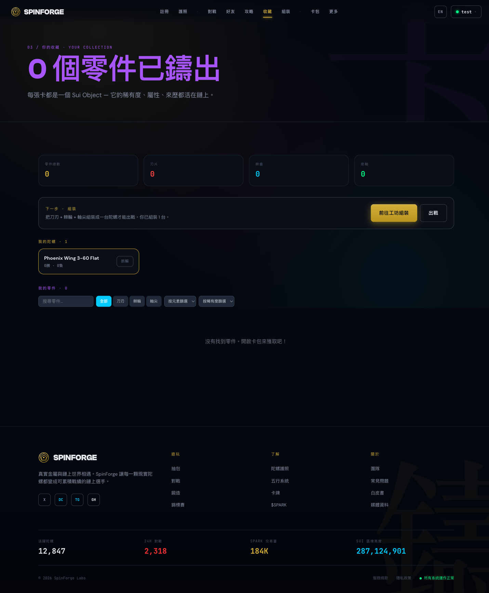

### Workshop — assemble a Beyblade
Combine one Blade + one Ratchet + one Bit into a battle-ready Bey. Mirrors the on-chain `bey::assemble` flow (parts become child objects of the Bey via dynamic object fields).

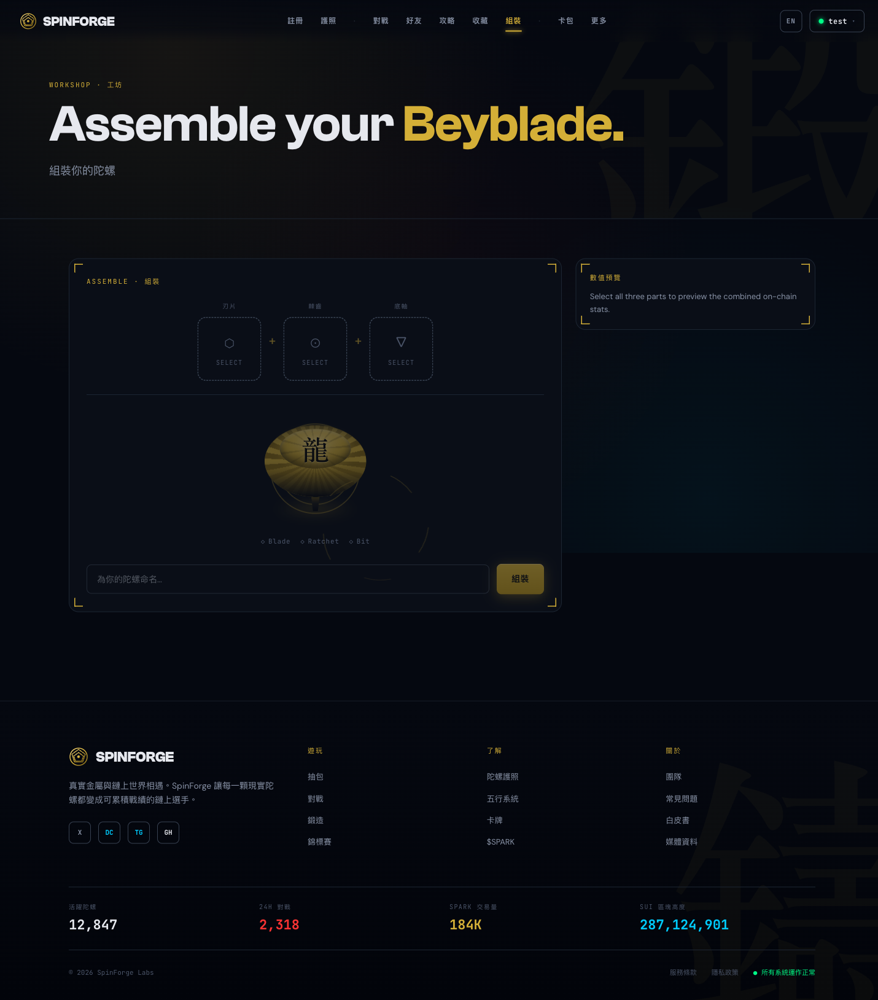

### Battle — record real-world matches
Players create a battle room with a share code, play their physical match, and both submit the result. Settlement requires **dual confirmation** (both players must agree on the same result hash) before the relay mints an immutable `BattleRecord` on Sui and updates ELO.

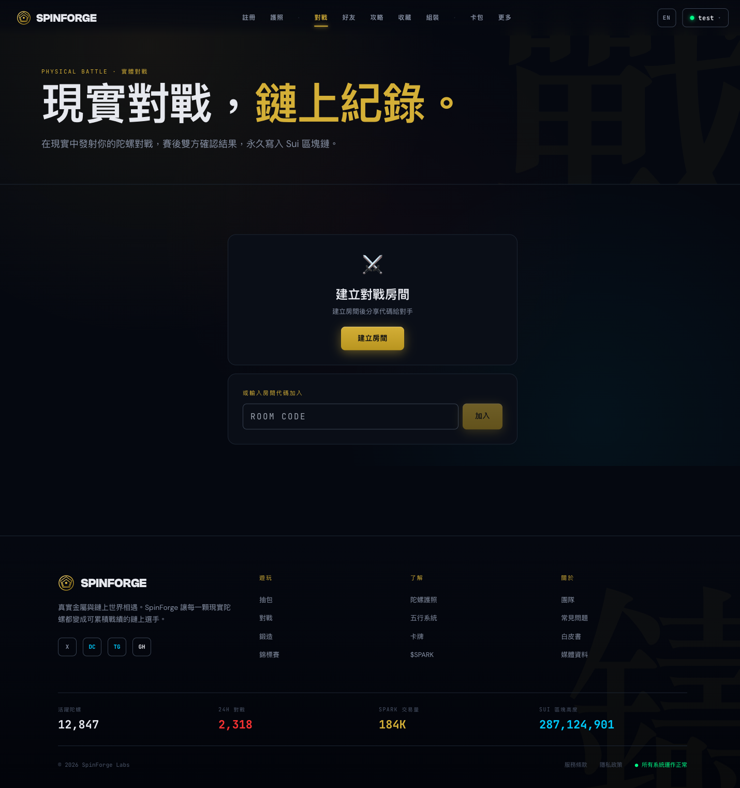

### Forge — upgrade parts with SPARK
Three operations, each burning SPARK and relayed on-chain:
- **Evolve** — 3 Common parts → 1 Rare (50 SPARK)
- **Fuse** — 2 Rare parts → 1 Epic (200 SPARK)
- **Retune** — reroll a Blade's attack stat (75 SPARK)

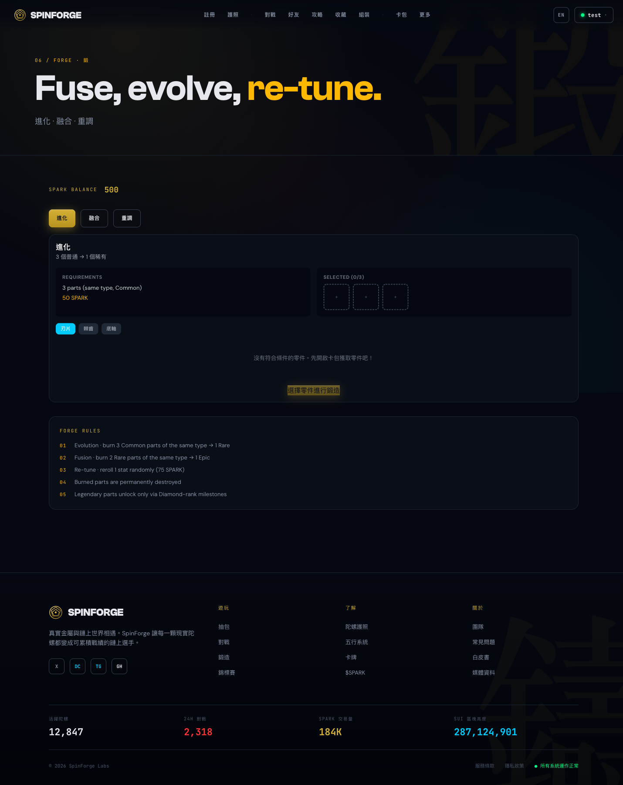

### Packs — gacha part minting
Open a pack for 100 SPARK and receive 5 random parts (2 Blades, 2 Ratchets, 1 Bit). Rarity odds: 70% Common / 22% Rare / 7% Epic / 1% Legendary, rolled with `sui::random` on-chain.

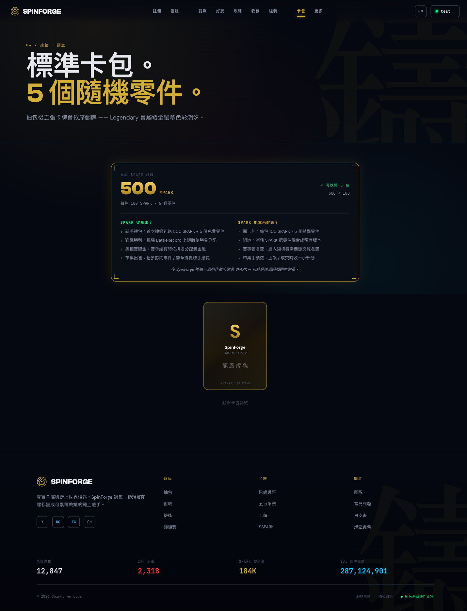

### Market — P2P trading (Sui Kiosk)
Marketplace built on the Sui Kiosk protocol with a `TransferPolicy` capping creator royalties at 2%.

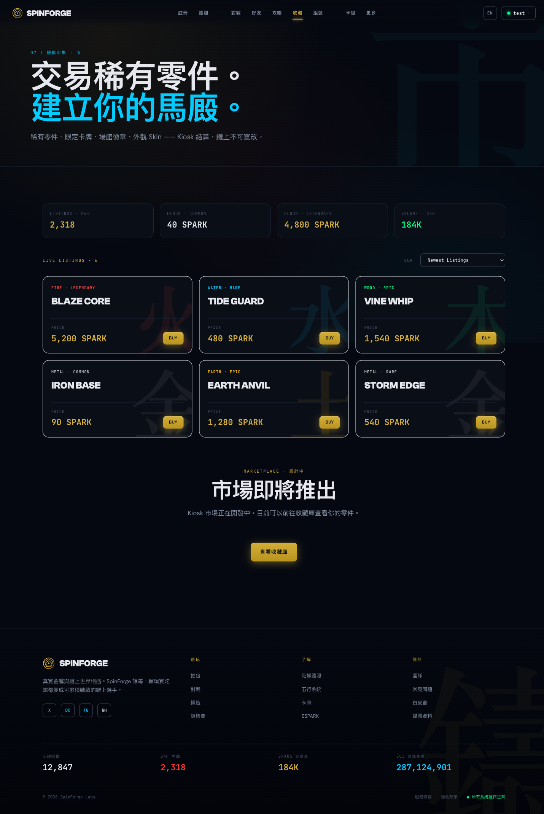

### Tournament — bracket competitions
Organizers create tournaments with an entry fee; fees are held in **escrow** (not burned) and the full prize pool pays out to the champion. Bracket advancement validates winners against the previous round.

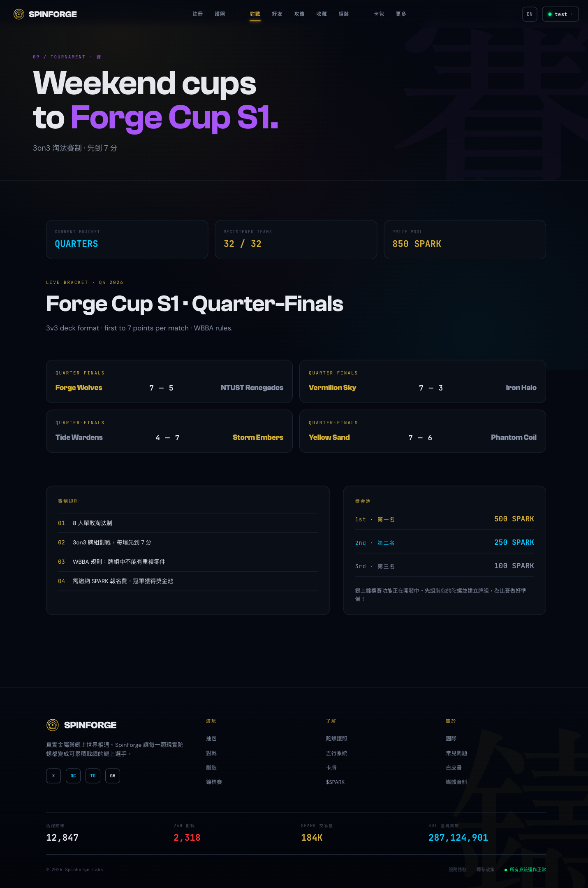

### Elements — the Wuxing system
Reference page for the five-element cycle (Wood → Earth → Water → Fire → Metal → Wood) and the five Spirit Beasts (Seiryu, Suzaku, Byakko, Genbu, Koryu) that determine each Blade's element.

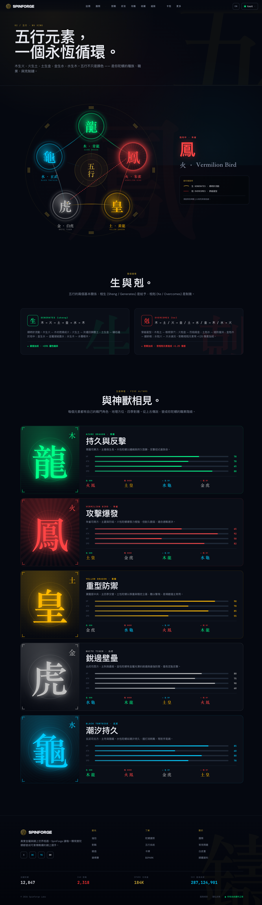

### Tokenomics — SPARK & FORGE
Explains the dual-token economy: **SPARK** (play-to-earn currency, 1B hard cap) and **FORGE** (governance, 100M hard cap).

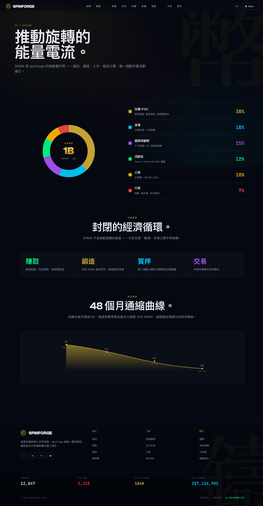

### Register — mint a passport for a physical top
Form to register a real-world rotor: name, blade, ratchet, bit selection. Submits to `/api/register-rotor`, which relays an on-chain mint into platform custody attributed to the user.

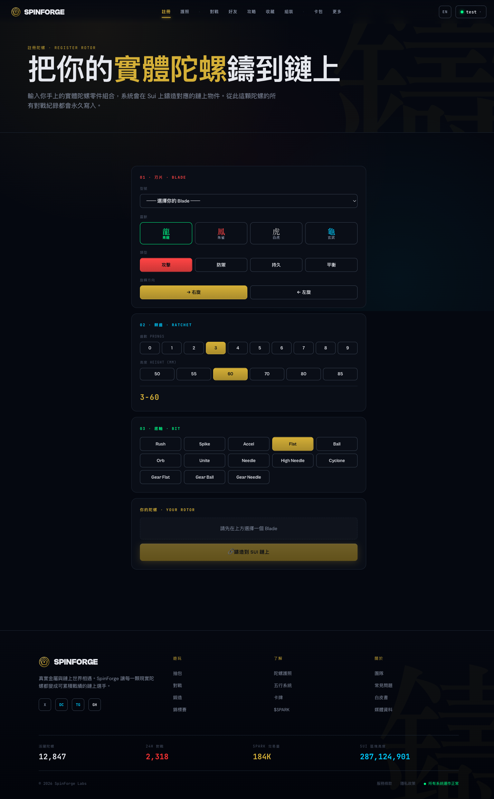

### Friends — social graph and direct messages
Friend requests, accept/block, and 1:1 chat. Stored in Postgres (`friendships`, `direct_chat_threads`, `chat_messages`).

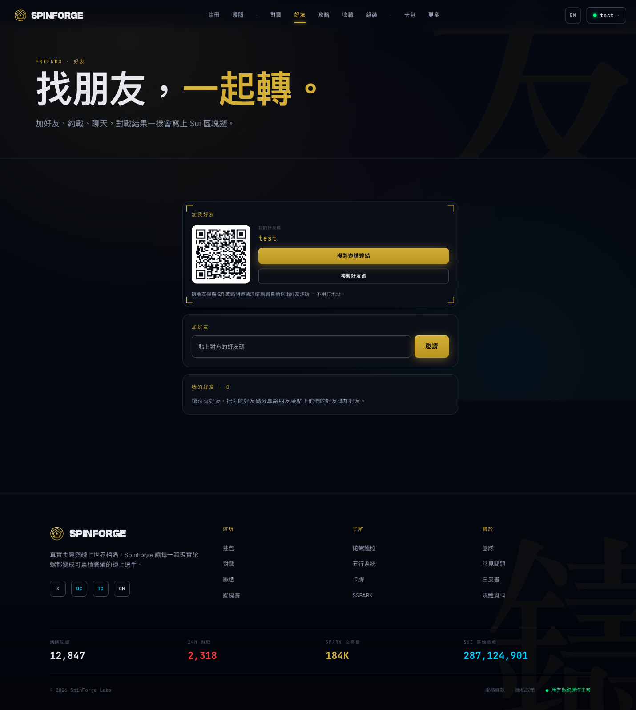

### Community — combo sharing and voting
Players publish Blade+Ratchet+Bit combo guides; others vote and comment.

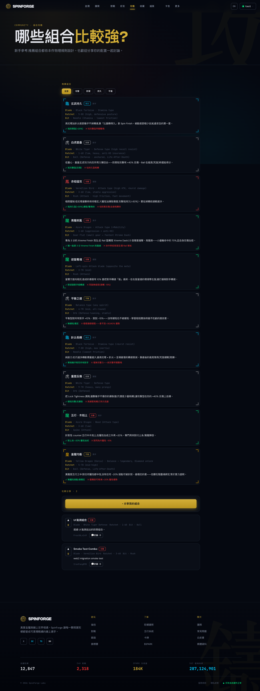

---

## 3. Smart Contracts (`contracts/sources/`, 20 modules)

Package `spinforge`, Move edition 2024.beta, targeting Sui testnet. **189 unit tests, all passing.**

### 3.1 Tokens

| Module | What it does |
|--------|-------------|
| `spark_token` | **SPARK** — in-game currency. 9 decimals, hard cap **1,000,000,000 SPARK**, per-call mint ceiling 100,000. Mint/burn gated by `TreasuryCap`. Consumed by packs (100), forge (50/200/75), tournaments. |
| `forge_token` | **FORGE** — governance token. 9 decimals, hard cap **100,000,000 FORGE**, same per-call ceiling and TreasuryCap gating. |

### 3.2 NFT Parts & Assembly

| Module | What it does |
|--------|-------------|
| `blade` | Attack ring. Fields: spirit beast (0–4, maps 1:1 to element), bey type (Attack/Defense/Stamina/Balance), spin direction, attack 10–100, recoil 10–80, rarity 0–3, XP. `mint`/`add_xp`/`set_attack` are package-private so players cannot self-buff via PTB. |
| `ratchet` | Disc frame. Prongs 0–9, height ∈ {50,55,60,70,80,85}, weight (moment of inertia), burst resistance. Display name like `3-60`. |
| `bit` | Tip. Category (Attack/Defense/Stamina/Gear), friction 2–80, mobility 1–5, gear diameter ∈ {0,4,6,8,10,12} (gear bits unlock Xtreme Dash), life-after-death flag. |
| `bey` | Assembled top. `assemble(blade, ratchet, bit)` stores the parts as child objects (dynamic object fields); `disassemble` returns them. Tracks wins/losses/xtreme/burst counters — updatable only by package code. |
| `deck` | Validated 3-Bey team. `create_deck` enforces that no Blade/Ratchet/Bit is reused across the three Beys. |
| `spirit` | **Soulbound** SpiritAvatar (no `store` ability — cannot be traded). AdminCap-gated mint; the Koryu beast requires Legendary tier. |
| `stadium` | Arena object: rail pattern (Standard X / Infinity / Dragon Maw / Fortress / Seasonal), rail zones, terrain element, owner fee ≤ 2%. |

### 3.3 Gameplay Engine

| Module | What it does |
|--------|-------------|
| `physics` | Pure stateless math: angular momentum (`weight × prong multiplier × launch efficiency`), damage with type & element multipliers, spin steal (10% on opposite spin), spin decay (friction + wobble), burst integrity loss, knockback. **Type triangle:** Attack beats Stamina (+30%), Stamina beats Defense (+20%), Defense reflects Attack (+40% recoil), Balance +10% vs all. **Wuxing:** the overcoming element gets +20%, same element −10%. |
| `battle` | Full 2-player match state machine with **commit–reveal**: both players commit `hash(zone ‖ salt)`, then reveal; the backend (AdminCap) calls `resolve_turn` with physics results. First to **7 points** wins. Scoring: Spin Finish 1pt, Over Finish 2pt, Burst Finish 2pt, Xtreme Finish 3pt. 30-second commit deadline with `claim_timeout`. |
| `xtreme_dash` | Signature move: requires a gear Bit **and** a rail in the current stadium zone. Accuracy scales with gear size (70% / 85% / 95%); hit = 1.5× damage, miss = 0.5× glancing; recoil is doubled. A dash that zeroes the defender is a 3-point Xtreme Finish. |
| `battle_record` | Immutable match attestation. Two paths: player dual-`confirm()` (auto-commits when both sign), or `create_committed()` minted by the relay after both players already confirmed in Postgres — carrying pseudonymous `*_subject` addresses + `operation_id` for DB attribution. |
| `player_profile` | Shared leaderboard object: ELO (base 1000, ±25 per match, floor 0), win/loss/finish counters. Mutations are AdminCap-gated so players cannot inflate their own stats. |

### 3.4 Economy & Distribution

| Module | What it does |
|--------|-------------|
| `pack` | Gacha. `open_pack` burns 100 SPARK and mints 5 random parts (2 Blade / 2 Ratchet / 1 Bit) using `sui::random`; rarity odds 70/22/7/1. `open_pack_for` is the relay/custody variant (SPARK debited from the DB ledger instead). Packs never drop the Koryu beast. |
| `forge` | Burn-to-upgrade: `evolve_*` (3 Common → 1 Rare, 50 SPARK), `fuse_blades` (2 Rare → 1 Epic, 200 SPARK), `retune_blade_attack` (reroll attack, 75 SPARK). SPARK payment is burned via TreasuryCap. |
| `register` | Onboarding: AdminCap-gated mint of a fixed Rare starter rotor (70 atk blade, 120 wt/300 br ratchet, 40 friction bit). `register_rotor_for` is the custody variant attributed via `recipient_subject` + `operation_id`. |
| `marketplace` | Sui Kiosk-based P2P listing/delisting of Blades with a shared `TransferPolicy`; max owner fee 200 bps (2%). |
| `tournament` | Bracket tournaments. Entry fees accumulate in an escrowed `Balance<SPARK>` (never burned); organizer advances rounds (winners must be a subset of the previous round) and `distribute_prizes` pays the champion exactly once (idempotent `distributed` flag). |
| `admin` | `AdminCap` capability + shared `GameConfig`: tunable physics constants (base decay 5%/turn, dash multiplier 1.5×, spin steal 10%, win score 7) and the player ban list. |

### 3.5 Security Patterns in the Contracts

- **AdminCap relay** — all state-changing settlement (`resolve_turn`, `record_battle_result`, record/spirit/starter minting) requires the platform's AdminCap; players cannot forge results.
- **Package-private mutators** — XP, stats, and mint functions are `public(package)`, closing the "self-buff via PTB" hole.
- **Hard supply caps** — SPARK 1B / FORGE 100M global caps plus 100K per-call mint ceilings enforce monetary policy on-chain.
- **Soulbound avatars** — `SpiritAvatar` lacks `store`, making milestone rewards non-transferable.
- **Escrowed prizes** — tournament fees sit in a `Balance` and pay out idempotently; no burn-and-remint risk.
- **Commit–reveal battles** — zone choices are hash-committed before reveal, preventing reaction cheating; timeouts punish stalling.
- **Custody attribution** — every relay-minted object carries an `operation_id` matching a Postgres `chain_operations` outbox row, so DB and chain can always be reconciled.

---

## 4. Web Application (`web/`)

### Authentication (web2-hybrid)
- **Better Auth** session cookies; email/password plus optional Google/Apple OAuth and magic links (`web/lib/auth.ts`).
- Every protected API route calls `requireGameUser(request.headers)`, which validates the session and auto-creates a `profiles` row with a unique handle and a deterministic **`chainSubject`** pseudonymous address used for on-chain attribution.
- **Guest mode** (Zustand + sessionStorage) lets visitors browse; write actions prompt sign-in.
- New accounts get a **one-time 500 SPARK starter grant**, enforced by a unique `(user_id, kind)` constraint in the `entitlements` table.

### Database (Drizzle → Neon Postgres, `web/lib/db/schema.ts`)
- **Auth:** `user`, `session`, `account`, `verification` (Better Auth core).
- **Game:** `profiles`, `ownership` (user ↔ on-chain object map with status lifecycle reserved→active→consumed/burned), `currency_accounts` (SPARK/FORGE balances with a `balance >= 0` check constraint), `currency_ledger`, `entitlements`.
- **Chain consistency:** `chain_operations` — a transactional outbox keyed by idempotency key, tracking each relay transaction through reserved → submitted → db_applied / reconcile_needed; `chain_indexer_cursors` for indexer checkpoints.
- **Battles:** `battle_rooms` (share-code lobbies with optimistic version), `battle_confirmations` (dual result-hash sign-off), `battles` (settled, with `tx_digest` + chain status), `leaderboard_entries` (per-season ELO).
- **Social:** `friendships`, `direct_chat_threads`, `chat_messages`, `community_posts/comments/votes`.

### On-chain relay (`web/lib/relay.ts`, `web/lib/forge-relay.ts`)
Three signer roles loaded from env: **minter** (packs/forge, holds SPARK TreasuryCap), **recorder** (battle records), **custodian** (owns custodied assets). A typical flow (e.g. pack open):
1. Reserve SPARK in the Postgres ledger (within a transaction, writing a `chain_operations` row).
2. Submit the Sui transaction via the relay signer.
3. On success: settle the reservation, mark new objects `active` in `ownership`; on failure: release the reservation or flag `reconcile_needed`.

### API surface (~28 routes under `web/app/api/`)
Auth (`/api/auth/*`), economy (`/api/balance`, `/api/claim-starter`, `/api/faucet`, `/api/open-pack`), assets (`/api/inventory`, `/api/assets/{assemble,disassemble,discard}`, `/api/register-rotor`), forge (`/api/forge/{evolve,fuse,retune}`), battles (`/api/battle-room`, `/api/submit-result`, `/api/battle-history`, `/api/leaderboard`), social (`/api/friends`, `/api/chat`, `/api/community`), profile (`/api/profile`, `/api/create-profile`). All mutating routes enforce same-origin checks and rate limiting.

### Rust server (`server/`, phase 2)
An axum + sqlx + Redis service for real-time WebSocket battle relay, matchmaking, and leaderboard caching (port 3001 via `docker-compose.yml`). Core gameplay currently runs entirely through the Next.js API routes; the Rust server is the planned real-time layer.

---

## 5. System Check Results (2026-06-10)

| Check | Result |
|-------|--------|
| Web unit/integration tests (`pnpm vitest run`) | ✅ 9 files, **41/41 passed** |
| TypeScript (`tsc --noEmit`) | ✅ clean, exit 0 |
| Move contract tests (`sui move test`) | ✅ **189/189 passed** |
| All 14 pages rendered (logged-in session, 1440×900) | ✅ zero console errors |
| Auth round-trip (email login → redirect to dashboard) | ✅ works |

**Known minor issues (non-blocking):**
1. **Workshop page title is not localized** — it shows "Assemble your Beyblade." even in Chinese locale (see screenshot 04), while the rest of the page is Chinese.
2. **Footer stats are static placeholders** (12,847 active rotors / 184K SPARK volume etc.), not live chain data.
3. **`Move.toml` ships with a `0x0` placeholder address** — the deployed testnet package ID lives in web env (`NEXT_PUBLIC_PACKAGE_ID`), which is correct for upgradability but worth knowing when reading the contracts standalone.
4. The Next.js dev server can serve stale chunks after long uptime (returns 404s for `_next/static` assets); a clean restart resolves it. Production builds are unaffected.

---

## 6. Repository Map

```
spinforge/
  contracts/         # Sui Move package (20 modules, 12 test files, 189 tests)
    sources/         # admin, battle, battle_record, bey, bit, blade, deck,
                     # forge, forge_token, marketplace, pack, physics,
                     # player_profile, ratchet, register, spark_token,
                     # spirit, stadium, tournament, xtreme_dash
  web/               # Next.js 14 app (pages + API + relay + Drizzle schema)
  server/            # Rust axum real-time server (phase 2)
  docs/              # This document, security audit, runbooks, GDD analyses
    screenshots/     # UI captures referenced above
  GDD_SpinForge.md   # Game design document
  AUDIT.md           # Security audit notes
```
